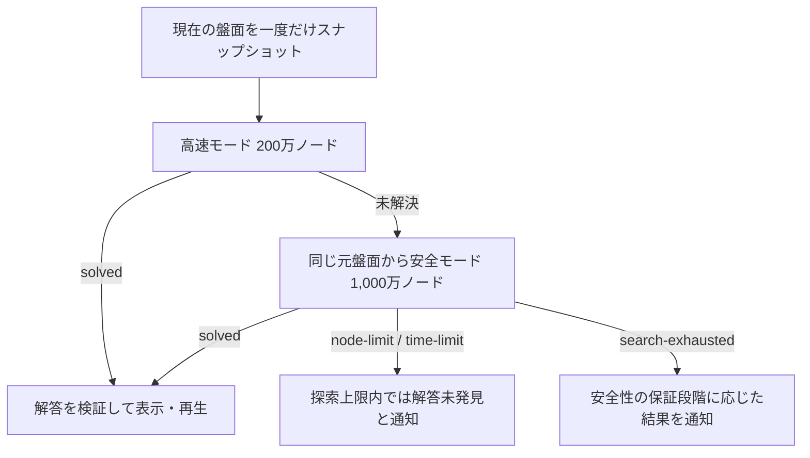

# 二段階ソルバー実装計画

## 1. 目的

Microsoft FreeCell互換のGame #1〜#32000を、現在の盤面から実用的な時間で解く。
探索は次の二段階とし、高速性と探索漏れの回避を両立する。

1. **高速モード**を200万ノードまで実行する。
2. 高速モードで解を得られなかった場合、元の盤面から**安全モード**を
   1,000万ノードまで実行する。
3. どちらでも解を得られなかった場合は、解なしと断定せず探索上限到達として通知する。

事前計算済み解答は製品へ埋め込まず、常に現在の盤面から解答を探索する。

## 2. モードの定義

### 2.1 高速モード

目的は、通常のゲームを短時間かつ少ないノード数で解くことである。
探索木の一部を失う可能性がある最適化を許容し、Game #1〜#32000で99%以上の
解決率を目標とする。

| 項目 | 設定・方針 |
| --- | --- |
| ノード上限 | 2,000,000 |
| 自動ホーム | 合法なら無条件に自動適用 |
| 完全性 | 保証しない |
| 未解決時 | 必ず安全モードへフォールバック |
| `unsolvable` | 返さない |
| 主な評価指標 | 解決率、p50/p90/p99時間、平均ノード数 |

高速モードでは、`node-limit`、`time-limit`、`search-exhausted` のいずれも
「高速探索では解を発見できなかった」という意味とし、ゲーム全体の解なし判定には
使用しない。

### 2.2 安全モード

目的は、高速モードが省略した探索枝を含めて探索し、追加の解答を発見することである。
解を取りこぼす可能性がある枝刈りは使用しない。

| 項目 | 設定・方針 |
| --- | --- |
| ノード上限 | 10,000,000 |
| 自動ホーム | 証明可能に安全な手だけ自動適用 |
| 安全でないホーム移動 | 探索分岐として保持 |
| 完全性 | 64bit Zobrist衝突を無視する仮定付き。数学的保証はしない |
| 探索終了時 | `unsolvable` (64bit Zobrist衝突を無視した評価) |
| 主な評価指標 | 高速モードからの追加解決数、探索漏れの有無 |

UI・ログ・文書上の名称は「安全探索」とし、`unsolvable` を数学的な「解なし証明」
とは表現しない。これはハッシュ衝突が発生していないという仮定付きの評価である。

## 3. 現状と実測値

### 3.1 現在の実装

`src/js/solver.js` の `solve()` は、`safeFoundationMoves` で自動ホーム方式を
切り替えられる。

- `false`: 無条件自動ホーム。高速モード相当。
- `true`: Horne's Rule相当の安全条件を使用。安全でないホーム移動は分岐に残す。

ただし、ブラウザー側はまだ二段階探索になっていない。

- `solver-client.js` は200万ノードの探索を1回だけ要求する。
- `solver.worker.js` は `safeFoundationMoves` を受け渡していない。
- `solve()` の既定値は `safeFoundationMoves: true` なので、現行UIは安全条件付き
  200万ノード探索を1回だけ実行している。

### 3.2 既存ベンチマーク

Game #1〜#5000に対する高速モード200万ノードの結果は次のとおりである。

| 指標 | 結果 |
| --- | ---: |
| solved | 4,992 / 5,000 |
| 解決率 | 99.84% |
| node-limit | 8 |

高速モードで未解決だった8件を安全モード500万ノードで再探索すると、7件を追加で
解決できた。高速モード500万ノードでは6件の追加解決だった。

この結果は、「高速200万ノード → 安全1,000万ノード」という二段階方式を支持する。

## 4. 完成時の処理フロー



高速モードの内部状態、置換表、経路は安全モードへ引き継がない。両モードで探索条件が
異なるため、安全モードはリクエスト開始時の元盤面から新規に実行する。

## 5. API設計

### 5.1 モードプリセット

真偽値を呼び出し側へ直接公開する方式をやめ、モード名と設定を一元管理する。

```js
export const SOLVER_PROFILES = {
  fast: {
    maxNodes: 2_000_000,
    maxTimeMs: 30_000, // UI用。ベンチマークはノード上限を主指標とする
    safeFoundationMoves: false,
  },
  safe: {
    maxNodes: 10_000_000,
    maxTimeMs: 180_000, // 1,000万ノードでは60秒では不足する可能性
    safeFoundationMoves: true,
  },
};
```

ベンチマークでは `maxNodes` を主要指標とし、UIではフリーズ感を避けるため
`maxTimeMs` も併用する。安全モード500万ノード時の実測（平均2.3秒、最大4.4秒）
から、1,000万ノードでは fast 30-60秒 / safe 120-600秒を目安に調整する。
初期値は上記の 30秒 / 180秒とし、全32,000ゲーム計測後に再調整する。

本計画完成後はUIの既定を `strategy: "fast-safe"` へ変更する。従来の safe
200万ノード単発からの変更は `CHANGELOG.md` に明記する。本計画では用語を
「高速モード」に統一する（従来の「高速実用モード」と同義）。

### 5.2 二段階制御関数

二段階制御はDOMやWorkerから分離し、単体テスト可能な関数にする。

候補:

```js
solveWithFallback(board, {
  fastOptions,
  safeOptions,
  onStageChange,
});
```

戻り値には最終結果と各段の結果を分けて保持する。

```js
{
  solved,
  status,
  moves,
  finalMode, // "fast" | "safe"
  strategy, // "fast-safe" など
  fallbackUsed,
  nodes, // 解答を得た段のノード数
  timeMs, // 解答を得た段の時間
  totalNodes, // fast + safe の合計
  totalTimeMs, // fast + safe の合計
  attempts: {
    fast: { status, nodes, timeMs },
    safe: { status, nodes, timeMs } | null,
  },
}
```

`nodes` / `timeMs` は解答を得た段、`totalNodes` / `totalTimeMs` は二段の合計とし、
意味を曖昧にしない。モード名は `finalMode` と `strategy` に分離する。

### 5.3 ステータス

| ステータス | 意味 |
| --- | --- |
| `solved` | 解答を発見した |
| `node-limit` | ノード上限に到達した |
| `time-limit` | 時間上限に到達した |
| `search-exhausted` | そのモードの探索空間を走査し終えた |
| `unsolvable` | 64bit Zobrist衝突を無視した探索上の解なし |

高速モードの `search-exhausted` は必ず安全モードへのフォールバック対象とする。

## 6. Worker・UI統合

### 6.1 `solver.worker.js`

1個のWorker内で高速モードと安全モードを順番に実行する。

受信メッセージ:

```js
{
  requestId,
  board,
  strategy: "fast-safe",
  fastOptions,
  safeOptions,
}
```

送信メッセージ:

```js
{ type: "stage", requestId, stage: "fast" }
{ type: "stage", requestId, stage: "safe" }
{ type: "result", requestId, result }
```

Workerを1個にすることで、キャンセルは現在と同じ `terminate()` で実現できる。

### 6.2 `solver-client.js`

次を実装する。

1. リクエスト開始時に盤面を一度だけ取得する。
2. `requestId` を採番し、古いWorker応答を無視する。
3. 高速モードの未解決ステータスをすべて安全モードへ渡す。
4. 最終的に得られた解答だけを `solution` に保存する。
5. 自動解答は高速モード失敗時には開始せず、安全モード成功後に一度だけ開始する。
6. 新しいゲーム、リスタート、別ゲーム番号の開始時に探索をキャンセルする。
7. 解答受信時に盤面がリクエスト開始時から変化していないことを確認する。

最後の確認には、盤面のカードID配列から決定的なスナップショット文字列または盤面キーを
作る。探索中にユーザーが操作した場合、古い解答を表示・再生しない。

### 6.3 `view.js`

探索段階を表示する。

- 高速モード: `高速探索中…`
- フォールバック後: `難しい配置です。安全探索中…`
- 最終未解決: `探索上限内では解答を発見できませんでした`

安全モード移行時もヒント・自動解答ボタンは無効のままにする。

## 7. 高速モードの改善計画

高速モードでは完全性を要求しないが、変更はGame #1〜#32000の解決率と応答時間で
評価する。

### 7.1 採用する改善

1. **無条件自動ホームを維持する**
   - Game #1〜#5000で99.84%を解決しており、探索木削減効果が大きい。
2. **現在の列正規化を維持する**
   - 列境界を保持した列単位ハッシュのソート方式を使用する。
3. **置換表の計測を追加する**
   - 使用スロット数、最大負荷率、平均・最大プローブ長、40プローブ到達回数、
     上書き回数を記録する。
   - 計測で不足が確認された場合だけ、容量を $2^{22}$ から $2^{23}$ へ増やす。
4. **モード専用のmove orderingを持つ**
   - 空列生成、フリーセル解放、長い連続列、ホーム露出を高速モード専用に調整する。
   - 1項目の加点だけで採用せず、全32,000ゲームで回帰確認する。

### 7.2 将来候補

- 200万ノードを複数の決定的な探索順序へ分割する簡易multi-scan。
- `getStateHash()` で毎ノード8列をソートするコストの削減。
- 内部Meta-Moveを基本手へ展開して返却する方式。

複数探索順序は二段階制御の完成後に検討し、最初の実装には含めない。

## 8. 安全モードの完全性強化計画

安全モードは「経験的に安全」ではなく、枝を失わないことを説明・検証できる状態を
目標とする。

### 8.1 自動ホーム条件の検証

- `isSafeFoundationMove()` の条件を全スート・全ランクについて表形式でテストする。
- 小盤面の全状態探索と比較し、安全判定したホーム移動を強制しても解決可能性が
  変わらないことを確認する。
- 安全性を十分に説明できない間は、安全モードでホーム移動を自動適用せず、すべて
  探索分岐にする検証オプションを用意する。

### 8.2 置換表の厳密化

現在は64bit Zobristハッシュだけで状態の同一性を判定するため、極低確率ながら衝突で
別状態を刈る可能性がある。

安全モードでは次を段階的に実施する。

1. 置換表の負荷率・上書き・プローブ統計を追加する。
2. 1,000万ノード時の $2^{22}$ と $2^{23}$ を比較する。
3. ハッシュ一致時に照合可能なコンパクトな正規化状態表現（例: 8列ソート済みID列の
   文字列またはバイナリ）を設計し、そのコストを計測する。
4. 完全性を主張する場合は、ハッシュだけでなく状態一致を確認して枝刈りする。

容量不足によるエントリ上書きは再探索を増やすだけに限定し、未登録状態を既知として
扱わないことをテストする。

### 8.3 経路依存枝刈りの検証

- `isReverse()` による即時逆手除外を無効化できるオプションを追加する。
- 小盤面全探索で、有効・無効の解決可能性が一致することを確認する。
- Game #1941 などで有効・無効の分岐数増加と解決率への影響を事前計測して定量化する。
- 置換表の状態キーに直前手が含まれない点との整合を検証する。
- 完全性を説明できない枝刈りは安全モードから除外する。

### 8.4 ヒューリスティックの分離

現在の `heuristic()` は次を加算し、過大評価になり得る。

```text
h = (残りカード数) + Σ(可動末尾より下のカード数)
```

過大評価が下限として使われると、本来解がある枝を `f = g + h > bound` で
不当に刈る可能性がある。次の役割を分離する。

- **下限ヒューリスティック**: IDA*の閾値・枝刈りに使用。過大評価しない。
- **順序評価**: 手の並べ替えだけに使用。過大評価を許容する。

両モードで「可動末尾より下のカード数」を含む実用的な探索評価を使用する。
この評価は最短解や完全性を保証しない。証明可能な下限を追加する場合は、性能と
解決率を別計測してから採用する。

### 8.5 安全なデッドロック検出

安全モードへ追加するデッドロック検出は、解なしを証明できる条件だけに限定する。
経験則による「悪そうな盤面」の刈り取りは高速モード専用とする。

## 9. ベンチマーク対応

### 9.1 `scripts/benchmark/run.js`

次のオプションを追加する。

```text
--strategy fast
--strategy safe
--strategy fast-safe
--fast-max-nodes 2000000
--safe-max-nodes 10000000
```

二段階結果は次のスキーマで保存し、既存 `batch-XX.json` と区別する。

```json
{
  "strategy": "fast-safe",
  "fast": { "solved": 999, "totalTimeMs": 10000 },
  "safe": { "solved": 1, "totalTimeMs": 5000 },
  "final": { "solved": 1000, "totalTimeMs": 15000 },
  "summary": {
    "fastSolved": 999,
    "safeAdditionalSolved": 1,
    "finalSolved": 1000
  }
}
```

途中結果から再開する場合は、戦略と両モードの設定が一致することを確認する。
既存の単段 `batch-XX.json` との互換性はファイル名または `strategy` フィールドで
区別する。

### 9.2 `scripts/benchmark/verify-node-limit.js`

高速モードで未解決だったゲームだけを安全モードで再検証できるようにする。
結果ファイル名にはモードと上限を含める。

例:

```text
verify-fast2m-safe10m-batch-01.json
```

### 9.3 `scripts/benchmark/report.js`

HTMLレポートへ次を追加する。

- 高速モードだけで解決
- 安全モードで追加解決
- 最終未解決
- フォールバック率
- fast・safe・合計のノード数と時間
- p50・p90・p99
- モード別の置換表統計

## 10. テスト計画

### 10.1 単体テスト

`tests/unit/solver.test.js` および新規の二段階制御テストで次を確認する。

1. 高速モードで解けた場合、安全モードを呼ばない。
2. 高速モードの全未解決ステータスで安全モードを呼ぶ。
3. 安全モードで解けた場合、その手順を返す。
4. 両モードで未解決の場合、安全モードの結果を最終結果にする。
5. `totalNodes` と `totalTimeMs` が両段の合計になる。
6. 両段が同じ元盤面から開始する。
7. 解答手順を `attemptMove()` で再生して勝利できる（両モード）。
8. 同じ盤面・設定でstatus、moves、nodesが決定的に一致する。
9. 高速モードは `unsolvable` を最終結果として扱わない。
10. Horne's Rule、正規化、逆手除外、置換表の安全性を小盤面で検証する。

### 10.2 E2Eテスト

1. 高速モード成功時に解答パネルが表示される。
2. 高速モード未解決後に表示が安全探索へ変わる。
3. 安全モード成功後にヒント・自動解答が正常に動作する。
4. 両段未解決時に断定的な「解けない」表示をしない。
5. 探索中の新規ゲームでWorkerが終了する。
6. 探索中に盤面を操作した場合、古い解答を表示・再生しない。
7. キャンセル済みリクエストの遅延応答を無視する。

E2Eでは1,000万ノードを実際に探索させず、Worker応答を差し替えて段階遷移を検証する。
実探索の正しさは単体テストとベンチマークで確認する。

### 10.3 回帰ベンチマーク

最低限、次を固定対象とする。

- #1、#12: 通常成功
- #1941: 高速500万でも未解決、安全500万では解決
- #3699、#3740、#3971、#4482、#4565、#4828: fallback成功例
- #4016: 両モード500万で未解決
- #11982: 既知の難しい配置

実装後はGame #1〜#5000を二段設定で再計測し、その後Game #1〜#32000へ拡大する。

## 11. 実装フェーズ

### フェーズ1: 二段階制御

対象:

- `src/js/solver.js`
- `src/js/solver.worker.js`
- `src/js/solver-client.js`
- `src/js/view.js`
- `src/js/main.js`

作業:

1. モードプリセットを定義する。
2. 二段階制御を純粋関数として実装する。
3. Workerプロトコルをstage/result形式へ変更する。
4. UIへ探索段階を表示する。
5. キャンセルと盤面変更検出を実装する。
6. 高速モードの未解決結果を必ず安全モードへ渡す。

完了条件:

- 高速200万 → 安全1,000万が自動実行される。
- 高速成功時は安全探索を実行しない。
- 途中盤面からのヒント・自動解答が正常に動作する。

### フェーズ2: テスト・計測基盤

1. 二段制御の単体テストを追加する。
2. Worker段階遷移のE2Eテストを追加する。
3. ベンチマークをfast/safe/fast-safeへ対応させる。
4. HTMLレポートを二段結果へ対応させる。
5. 置換表統計を追加する。

完了条件:

- `npm test` が成功する。
- Game #1〜#5000の二段ベンチマークを再現できる。
- 各段と合計のコストを区別して比較できる。

### フェーズ3: 安全モードの完全性強化

1. 自動ホーム条件を全状態比較で検証する。
2. 逆手除外を検証・必要に応じて無効化する。
3. 下限ヒューリスティックと順序評価を分離する。
4. 置換表のハッシュ衝突対策を実装する。
5. 完全性を説明できない枝刈りを除去する。

実装状況(2026-08-18): 置換表は計算量とメモリ使用量を抑えるため64bit Zobrist
ハッシュのみで状態を識別する方針に統一した。両モードで、逆手除外は自動ホームが
発生した場合に直前の分岐手を無効化し、移動枚数も比較する安全化を適用した。
逆手除外の有効・無効で小規模盤面の
解決可能性が一致する回帰テストを追加した。ただし、これだけでは全状態の安全性を
証明しないため、完全性の主張は行わない。
ハッシュ衝突は実用上無視するが、
`unsolvable` は衝突が発生していないという仮定付きの探索結果であり、数学的な完全
証明ではない。両モードは同じ実用的な探索評価を使用し、最短解や完全性を保証しない。
全状態比較による自動ホーム条件の検証と、小規模盤面での基準全探索
との網羅的比較は未完了であり、フェーズ3の完了とはしない。

完了条件:

- 小規模盤面で基準となる全探索と解決可能性が一致する。
- 安全モードが使用する全枝刈りの安全性を文書化できる。
- `unsolvable` を数学的な完全証明としてUIへ表示しない。表示する場合も、64bit
  Zobrist衝突を無視した探索結果であることを明示する。

### フェーズ4: 全32,000ゲーム評価

1. 高速モード200万で全32,000ゲームを計測する。
2. 未解決ゲームだけ安全モード1,000万で計測する。
3. 二段方式の最終解決率、時間、ノード数を集計する。
4. 未解決ゲームを分類し、次の改善対象を決める。

目標:

- 高速モード単独の解決率99%以上（Game #1-5000では既に99.84%、全32,000でも維持）。
- 二段方式で既知の解なし配置を除き可能な限り全件解決。
- 通常ゲームの応答性能を現状から大きく悪化させない。

## 12. リスクと対策

| リスク | 対策 |
| --- | --- |
| 安全探索が長時間化する | Worker実行、時間上限、キャンセルを維持する |
| 高速探索後の解答が古い盤面へ適用される | requestIdと盤面スナップショットを照合する |
| 置換表が1,000万探索で飽和する | 負荷率を計測し、必要な場合だけ容量を増やす |
| safeという名称だけで完全性を誤認する | 完全性検証までは「安全探索」と表記する |
| `unsolvable` を誤って返す | 完全性確立までは上限到達・探索完了として通知する |
| E2Eが長時間化する | Worker応答をテスト用に差し替える |
| モードごとの設定が分散する | プリセットと二段制御を一か所に集約する |

## 13. 変更予定ファイル

| ファイル | 変更内容 |
| --- | --- |
| `src/js/solver.js` | モードプリセット、完全性設定、置換表統計 |
| `src/js/solver.worker.js` | 二段実行、stage/resultメッセージ |
| `src/js/solver-client.js` | フォールバック、requestId、盤面変更検出 |
| `src/js/view.js` | 高速・安全探索の段階表示 |
| `src/js/main.js` | 新規ゲーム時の探索キャンセル |
| `scripts/benchmark/run.js` | fast/safe/fast-safe戦略 |
| `scripts/benchmark/verify-node-limit.js` | 高速未解決の安全再検証 |
| `scripts/benchmark/report.js` | 二段探索の集計・表示 |
| `tests/unit/solver.test.js` | モード・完全性・回帰テスト |
| `tests/e2e/freecell.spec.js` | UI段階遷移・キャンセルテスト |
| `CHANGELOG.md` | 実装内容と検証結果 |
| `docs/freecell-solver-report.md` | 実装後の性能評価 |

## 14. 採用判断

二段階探索は、既存の実測で次の利点が確認されている。

- 高速モードはGame #1〜#5000の99.84%を200万ノード以内で解決した。
- 高速モードで未解決だった8件中7件を安全モード500万で追加解決した。
- #1941は高速500万でも未解決だが、安全モードでは265,145ノードで解決した。

したがって、まず二段階制御を実装し、その後に両モードを独立して改善する方針を採用する。
安全モードの完全性強化と全32,000ゲームの評価は、二段階制御の完成後に段階的に行う。

## 15. フェーズ4計測結果 (2026-08-18)

最新実装で `fast-safe` 戦略をGame #1〜#32000へ適用した。高速モードは2,000,000
ノード/30秒、安全モードは10,000,000ノード/180秒とし、安全モードでは逆手除外を
無効化した。64bit Zobristハッシュの衝突は実用上無視している。

| 指標 | 結果 |
| --- | ---: |
| 計測ゲーム数 | 32,000 |
| solved | 31,974 |
| 解決率 | 99.919% |
| node-limit | 26 |
| time-limit | 0 |
| unsolvable | 0 |
| 総ノード数 | 945,619,538 |
| 平均ノード数 | 29,550.6 |
| 総計算時間 | 1,326,484 ms |
| 平均計算時間 | 41.45 ms |
| 安全モードへフォールバックしたゲーム | 26 |

安全モードでも未解決だったゲームは、`#1941`、`#3670`、`#4016`、`#4828`、`#5495`、`#6240`、
`#9781`、`#10692`、`#11552`、`#11982`、`#12475`、`#13701`、`#13705`、`#13777`、`#14212`、`#17432`、
`#17880`、`#18783`、`#19975`、`#21491`、`#24327`、`#25315`、`#26334`、`#27101`、`#31433`、`#31465`で、
すべて `node-limit` だった。`unsolvable` は発生していない。

この結果により、全32,000ゲームの性能評価と未解決ゲームの分類は完了した。なお、
`unsolvable` は64bit Zobrist衝突を無視した探索上の結果であり、数学的な完全証明では
ない。フェーズ3の網羅的な完全性検証は引き続き未完了である。
