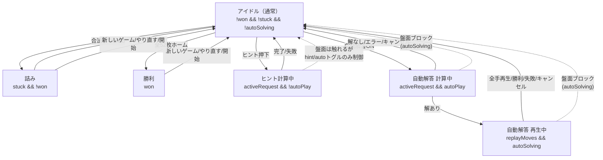

# UI状態遷移表（フリーセル）

## 1. 目的

本ドキュメントは、ゲームの状態に対して各UIコントロールを Enable / Disable すべきかを
一貫した方針で整理することを目的とする。

特に以下の不整合を起点として洗い出しを行った。

- 自動解答トグルをONにすると「高速探索中…」→「自動解答中…」へ表示が遷移するが、
  トグルをOFFにしてもラベルが「自動解答」に戻らない
- 自動解答中（盤面操作がブロックされる状態）にもかかわらず「自動でホームへ送る」
  チェックボックスを操作できてしまい、意味のないUIになっている

上記を含め、「どの状態でどの操作が可能か」を表として明文化し、
今後の修正の基準とする。

## 2. 状態定義

### 2.1 3層の状態モデル

ゲームの見かけ上の状態は、以下の3層の組合せで決まる。

| 層 | 責務 | 主な保持場所 | 代表的な値 |
| --- | --- | --- | --- |
| ゲーム状態 | 盤面と勝敗 | `src/js/game-state.js` | `won`, `stuck`, `historyStack`, `selected` |
| アプリ排他状態 | 手動操作のブロックと自動ホーム送り | `src/js/app.js` | `autoSolving`, `autoMoveEnabled` |
| ソルバー派生状態 | Worker計算と解答再生 | `src/js/solver-client.js` / `src/js/view.js` | `activeRequest` (`autoPlay` 真偽), `replayMoves`, `solverMode` |

### 2.2 ゲーム状態（正準状態）

`src/js/game-state.js` が所有する状態。

- **通常進行中** (`!won && !stuck`)
  - `historyStack.length === 0`（初手前）と `> 0` で Undo 可否が分かれる
  - `selected !== null` は一時的な選択状態だが、Enable/Disableには影響しない
- **詰み** (`stuck === true`, `!won`)
  - `hasAnyMove(state) === false` のとき `checkStuck()` が `stuck = true` にする
  - `undo()` で `stuck = false` に戻る
- **勝利** (`won === true`)
  - `isWon()`（全52枚が `foundations`）で `checkWin()` が `won = true` にする
  - 以降は `attemptMove()` が `reason: "finished"` で拒否される

タイマー（`app.js: timerStart / timerHandle`）は Enable/Disable に直接影響しない。
勝利時に停止されるのみである。

### 2.3 アプリ排他状態

`src/js/app.js` が所有する状態。

- `autoSolving: boolean`
  - `true` の間、`attemptMove()` / `undo()` / `autoMoveHome()` /
    `dblClickAutoMove()` がガードされ、`interactions.js: isBlocked()` が
    盤面操作を抑止する
  - `view.setAutoSolving()` で `#game.auto-solving` クラスが付与される
- `autoMoveEnabled: boolean`
  - 手動移動成功後の `chainAutoNext()` を実行するか否か
  - `solver-client.js: startAnimatedReplay()` 中は一時的に `false` にされる

### 2.4 ソルバー派生状態

`src/js/solver-client.js` と `src/js/view.js` の協調で決まる状態。

| 派生状態 | 条件 | `view.setSolverBusy()` の mode | ラベル表示 |
| --- | --- | --- | --- |
| アイドル | `!activeRequest && !autoSolving` | `null` | 自動解答 |
| ヒント計算中 | `activeRequest && !autoPlay` | `hint` | 変化なし |
| 自動解答 計算中 | `activeRequest && autoPlay` | `auto` | 計算中… → 高速探索中… / 安全探索中… |
| 自動解答 再生中 | `replayMoves !== null && autoSolving` | `auto`（`setSolverStage("replay")`） | 自動解答中… |

補足:

- ヒント計算中は `hint-btn` を `disabled` にし、自動解答トグルを `disabled` にする
  （`view.js: setSolverBusy()` の `hint` 分岐）
- 自動解答 計算中は `hint-btn` を `disabled` にするが、自動解答トグルは
  `disabled = false` のまま（OFFでキャンセル可能にする意図）
- 再生中は `activeRequest` は既に `null` だが `autoSolving` が `true` のまま残る

### 2.5 状態遷移図

到達不能な組合せ:

- 勝利中にヒント/自動解答の計算・再生は開始しない（`boardSnapshot` 不一致で破棄される）
- 詰みと勝利は排他（`game-state.js: checkStuck()` は `won` なら詰みにしない）

## 3. コントロール一覧

`index.html` のツールバーと盤面・オーバーレイに存在する操作の一覧。
「現在の制御箇所」はコード上の `disabled` 制御やガードの位置を指す。

| ID / 領域 | 表示名 | 役割 | 現在の制御箇所 |
| --- | --- | --- | --- |
| `new-game-btn` | 新しいゲーム | ランダム番号で `startGame()` | 制御なし（常時有効） |
| `restart-btn` | やり直す | 同じ番号で `startGame(state.gameNumber)` | 制御なし |
| `undo-btn` | 元に戻す | `gameState.undo()` | `view.js: updateStatus()` で `historyStack.length===0 \|\| won` 時に `disabled` |
| `auto-move-btn` | 自動移動 | `gameState.hasAutoMove()` があれば `chainAutoNext()` | `app.js: autoMoveHome()` で `autoSolving` 時に早期return（`disabled` は付けない） |
| `hint-btn` | ヒント | `solverClient.requestSolution({autoPlay:false})` | `view.js: setSolverBusy()` で `busy` 時に `disabled` |
| `auto-solve-toggle` | 自動解答 | ONで `requestSolution({autoPlay:true})`、OFFで `cancelAutoSolve()` | `view.js: setSolverBusy()` で `hint` 時に `disabled`、`auto` 時は `disabled=false` |
| `auto-move-toggle` | 自動でホームへ送る | `autoMoveEnabled` を切替 | `app.js: setAutoMoveEnabled()` で `checked` のみ同期、`disabled` 制御なし |
| `seed-input` | No. | ゲーム番号入力 | 制御なし |
| `start-game-btn` | 開始 | `normalizeGameNumber()` して `startGame()` | 制御なし |
| `#game` 盤面 | 盤面操作 | クリック / ドラッグ&ドロップ / ダブルクリック | `interactions.js: isBlocked()` と `app.js: attemptMove()` の `autoSolving` ガード、`game-state.js: attemptMove()` の `won` ガード |
| `#overlay` | オーバーレイ | 詰み/勝利の通知。背景クリックで閉じる | `view.js: showWin()` / `showStuck()` / `hideOverlay()` |
| `overlay-undo` | 1手戻す | 詰み時のみ表示される Undo | `view.js: showWin()` で `hidden`、 `showStuck()` で表示 |
| `overlay-new-game` | 新しいゲーム | オーバーレイ内の新規ゲーム | 制御なし |
| `solution-panel` | 解答手順パネル | 自動解答完了後に全手順を表示 | `view.js: showSolution()` / `hideSolution()` |

`move-counter` / `timer` は表示のみで操作対象外のため表から除外する。

## 4. 状態 × コントロール対応表

**凡例**: ◎ 有効 / × 無効（`disabled` または操作が拒否されるべき） / △ 条件付き

「あるべき姿」を示す。現状との差異は 5章で扱う。

### 4.1 ツールバー（主要ボタン）

| 状態 | 新しいゲーム | やり直す | 元に戻す | 自動移動 | ヒント | 自動解答トグル | 自動でホームへ送る |
| --- | --- | --- | --- | --- | --- | --- | --- |
| アイドル（通常・履歴なし） | ◎ | ◎ | × 履歴なし | △ 送れるカードがあれば◎ | ◎ | ◎ OFF | ◎ |
| アイドル（通常・履歴あり） | ◎ | ◎ | ◎ | △ 同上 | ◎ | ◎ OFF | ◎ |
| 詰み | ◎ | ◎ | ◎ | × 合法手なしのため | ◎ | ◎ OFF | ◎ |
| 勝利 | ◎ | ◎ | × `won` のため | × 完了済み | × 完了済み | × 完了済み | × 完了済み |
| ヒント計算中 | ◎ | ◎ | △ 履歴があれば◎ | × 計算中 | × 計算中 | × 計算中 | ◎ |
| 自動解答 計算中 | × 中断はトグルOFFで | × 同左 | × ブロック中 | × ブロック中 | × 計算中 | ◎ ON（OFFでキャンセル） | × ブロック中 |
| 自動解答 再生中 | × 中断はトグルOFFで | × 同左 | × ブロック中 | × ブロック中 | × 再生中 | ◎ ON（OFFでキャンセル） | × ブロック中 |

### 4.2 入力欄・盤面・オーバーレイ

| 状態 | No.入力 | 開始 | 盤面操作（クリック/ドラッグ/ダブルクリック） | オーバーレイ |
| --- | --- | --- | --- | --- |
| アイドル（通常・履歴なし） | ◎ | ◎ | ◎ | 非表示 |
| アイドル（通常・履歴あり） | ◎ | ◎ | ◎ | 非表示 |
| 詰み | ◎ | ◎ | × 詰み（合法手なし）だが盤面クリック自体は可能。移動は失敗する | 表示（詰み）・「1手戻す」◎ |
| 勝利 | ◎ | ◎ | × `won` のため拒否 | 表示（クリア）・「1手戻す」× |
| ヒント計算中 | ◎ | ◎ | ◎（ヒント計算は盤面をブロックしない） | 非表示 |
| 自動解答 計算中 | × ブロック中 | × ブロック中 | × `autoSolving` のためブロック | 非表示 |
| 自動解答 再生中 | × ブロック中 | × ブロック中 | × `autoSolving` のためブロック | 非表示 |

### 4.3 補足

- 「新しいゲーム」「やり直す」「開始」「No.入力」を自動解答中に × とする理由:
  現在の `main.js: clearSolutionOnNewGame` は新しいゲーム開始時に
  `cancelAutoSolve()` を呼ぶが、自動解答トグルがONのまま計算・再生が
  走っている間に新規ゲームを始めると `boardSnapshot` 不一致で破棄される
  競合が起きる。トグルOFFによる明示的な中断を経由させる方が一貫する。
- 詰み状態の盤面操作は「×」としたが、厳密には `hasAnyMove()===false` のため
  どの移動も失敗する。UI上は盤面クリック自体は受け付けるが結果が変わらない。
- 勝利状態の「自動でホームへ送る」は全カードがホームにあるため操作の意味がない。
  `disabled` にして意図を明示すべきである。

## 5. 既知の不整合

### 5.1 自動解答トグルOFFでもラベルが「自動解答」に戻らない

| 項目 | 内容 |
| --- | --- |
| 現象 | 自動解答ON → 「計算中…」→「高速探索中…」→「自動解答中…」と遷移するが、トグルをOFFにしてもラベルが「自動解答」に戻らない場合がある |
| 期待 | トグルOFF（`cancelAutoSolve()`）で常にラベルが「自動解答」に戻り、`solverMode` が `null` になる |
| 関連コード | `src/js/view.js: setSolverBusy()` / `setSolverStage()` / `solverMode` / `label.dataset.prevText`, `src/js/solver-client.js: cancelAutoSolve()` / `finishAutoSolve()` / `setBusy()` |
| 推定原因 | `view.js` は `solverMode === "auto"` のときのみラベルを書き換える。`solver-client.js` の `cancelAutoSolve()` は `activeRequest.autoPlay` の有無で分岐し、`activeRequest` が `null` かつ `autoSolving===true`（再生中のキャンセル）のパスでは `stopWorker()` せず `finishAutoSolve()` のみ呼ぶ。`finishAutoSolve()` は `setBusy(false)` を呼ぶが、このとき `activeRequest` が既に `null` のため `setBusy()` 内の `mode` 判定が `autoSolving ? "auto" : "hint"` で `auto` になる場合とならない場合がある。さらに `setSolverBusy(false,"auto")` での復元は `label.dataset.prevText` が存在するときのみ行われ、計算中キャンセルと再生中キャンセルの順序で `prevText` が残留または消失し、復元がスキップされる |
| 影響 | ユーザーは自動解答が終了したか否かをラベルで判断できず、トグルのON/OFF状態と表示が乖離する |

### 5.2 自動解答中に「自動でホームへ送る」を操作できてしまう

| 項目 | 内容 |
| --- | --- |
| 現象 | 自動解答中（`autoSolving===true`、盤面操作はブロック）に「自動でホームへ送る」チェックボックスをON/OFFできる。トグルしても自動解答の再生には影響しない（ように見える）が、終了後に意図しない `autoMoveEnabled` が残る |
| 期待 | 自動解答 計算中・再生中は「自動でホームへ送る」チェックボックスを `disabled` にする。終了時に元の値（`savedAutoMoveEnabled`）へ復元する |
| 関連コード | `src/js/solver-client.js: startAnimatedReplay()`（`app.setAutoMoveEnabled(false)` で一時無効化）、`src/js/view.js: setSolverBusy()`（`hint`/`auto` で `auto-move-toggle` を制御していない）、`src/js/app.js: setAutoMoveEnabled()` |
| 推定原因 | `solver-client.js` は再生開始時に `app.setAutoMoveEnabled(false)` で自動ホーム送りを抑止するが、View 側で `auto-move-toggle` 要素を `disabled` にしていない。ユーザーがチェックボックスを触ると `main.js` 相当の `change` ハンドラ（`app.js: mount()` 内）で `autoMoveEnabled` が即座に上書きされ、ソルバーの手順通りに進む保証が崩れる。`finishAutoSolve()` は `savedAutoMoveEnabled` を `true` 固定で復元しており、元のユーザー設定が失われる問題もある |
| 影響 | 意味のないUI操作を許容し、終了後の自動ホーム送り設定がユーザーの意図とずれる |

### 5.3 その他の一貫性の欠け（参考）

| 項目 | 現状 | あるべき姿 |
| --- | --- | --- |
| `undo-btn` 以外のボタンの `disabled` 制御 | `view.js: updateStatus()` は `undo-btn` のみ制御。他は常時有効で `app.js` 側の早期returnに依存 | 実行できない状態では `disabled` を付与し、見た目と操作可否を一致させる（4章の表に準拠） |
| ヒント計算中の新規ゲーム操作 | 可能（`clearSolutionOnNewGame` でキャンセルされる） | 許容するが、計算中であることを示すために `hint-btn` は `disabled` のままにする（現状通り） |
| 詰み時の `auto-move-btn` | 有効だが押してもトースト「ホームへ移動できるカードはありません」 | `disabled` にして押せないことを明示（詰みなら `hasAutoMove()===false` が保証される） |

## 6. 推奨ポリシー

今後の修正で統一すべき Enable/Disable の原則。

1. **実行できない操作は `disabled` で示す**
   - `app.js` の早期returnだけでなく、`view.js` で `button.disabled = true` を付与する。
     見た目（`style.css: .controls button:disabled`）と操作可否を一致させる。

2. **排他状態ではトグルを `disabled` にする**
   - ヒント計算中は自動解答トグルを `disabled`
   - 自動解答 計算中・再生中は「自動でホームへ送る」トグルを `disabled`
   - 自動解答トグル自体は計算中・再生中に `disabled=false` を維持し、OFFでキャンセルできる唯一の手段とする

3. **盤面操作のブロックは `autoSolving` と `won` で一元化する**
   - `interactions.js: isBlocked()` と `app.js: attemptMove()` の `autoSolving` ガードを正とする
   - `won` は `game-state.js: attemptMove()` の `finished` ガードで拒否する

4. **ラベル表示は `solverMode` で厳密に管理する**
   - `solverMode` が `null` のときのみ「自動解答」
   - `auto` のときのみ「計算中…」「高速探索中…」「安全探索中…」「自動解答中…」を許可
   - `finishAutoSolve()` / `cancelAutoSolve()` の全パスで
     `setSolverBusy(false, "auto")` を経由し、`label.dataset.prevText` を
     確実にクリアする

5. **新規ゲーム系操作は自動解答中に `disabled` にする**
   - 「新しいゲーム」「やり直す」「開始」「No.入力」は自動解答 計算中・再生中に `disabled`
   - 中断したい場合は自動解答トグルOFFを経由させる

6. **自動ホーム送りの保存・復元を正確に行う**
   - `startAnimatedReplay()` で `savedAutoMoveEnabled = autoMoveEnabled` の現在値を保存
   - `finishAutoSolve()` / `cancelAutoSolve()` で保存値へ復元する（`true` 固定にしない）

## 7. 今後の修正方針

本ドキュメントは状態とUIの対応を定義するものであり、実装の修正自体は含めない。
修正時には以下の箇所を参照すること。

| 修正対象 | ファイルと関数 | 対応する不整合 |
| --- | --- | --- |
| ラベル復元ロジック | `src/js/view.js: setSolverBusy()` / `setSolverStage()` | 5.1 |
| 自動解答の中断パス | `src/js/solver-client.js: cancelAutoSolve()` / `finishAutoSolve()` / `setBusy()` | 5.1 |
| 自動ホーム送りトグルの `disabled` 制御 | `src/js/view.js: setSolverBusy()` に `auto-move-toggle` の制御を追加 | 5.2 |
| 自動ホーム送りの保存・復元 | `src/js/solver-client.js: startAnimatedReplay()` / `finishAutoSolve()` の `savedAutoMoveEnabled` | 5.2 |
| 各ボタンの `disabled` 制御の追加 | `src/js/view.js: updateStatus()` または新設の `updateControls(state, solverState)` | 5.3 |
| 新規ゲーム系の `disabled` 制御 | `src/js/view.js: setSolverBusy()` / `setAutoSolving()` | 4章の表 |
| E2Eテストの追加 | `tests/e2e/freecell.spec.js` に自動解答トグルのON/OFFとラベル検証、自動ホーム送りトグルの `disabled` 検証を追加 | 全体 |

修正後は `npm test`（単体 + E2E）が全て成功することを確認し、
本ドキュメントの「あるべき姿」と実装が一致しているかを再検証すること。

## 8. 参考

- `src/js/game-state.js` — 状態遷移の正準実装
- `src/js/app.js` — `autoSolving` / `autoMoveEnabled` と操作ガード
- `src/js/view.js` —
  `updateStatus()` / `setSolverBusy()` / `setSolverStage()` / `setAutoSolving()`
- `src/js/solver-client.js` —
  `requestSolution()` / `startAnimatedReplay()` / `finishAutoSolve()` /
  `cancelAutoSolve()`
- `src/js/main.js` — `clearSolutionOnNewGame` とイベント配線
- `src/js/interactions.js` — `isBlocked()` による盤面ブロック
- `index.html` — コントロールIDの一覧
- `AGENTS.md` — 品質チェック（`npm test` / markdownlint）の規約
