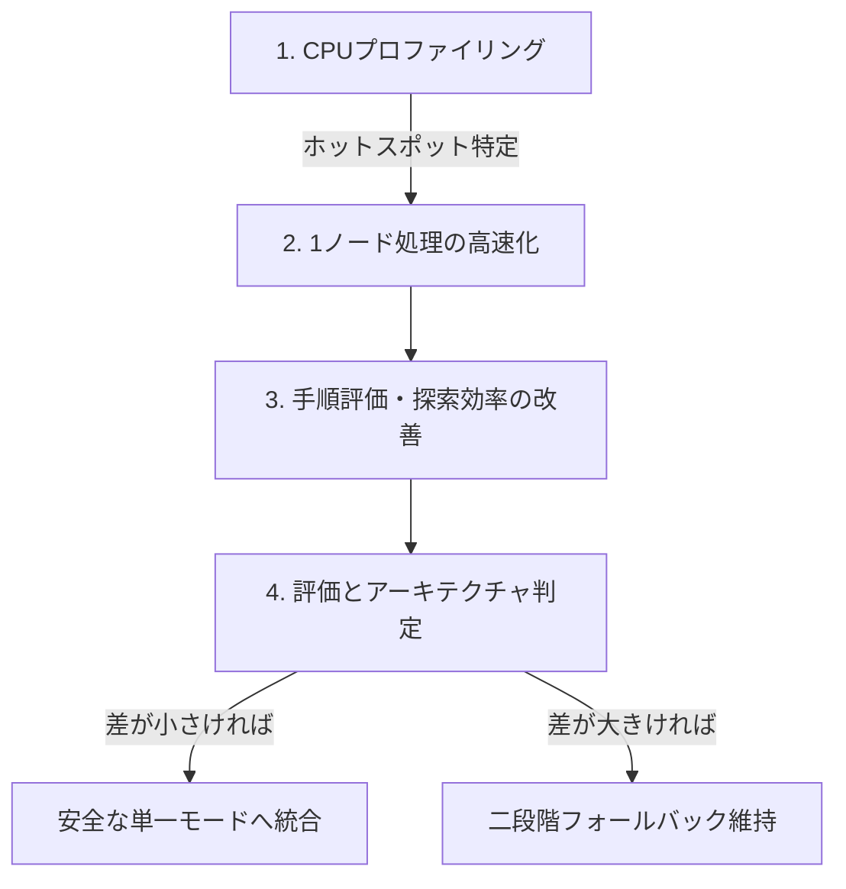

# ソルバーの知見と今後の高速化改善計画

## 1. 概要と背景

Microsoft FreeCell互換のGame #1〜#32000を対象としたソルバー（IDA* + 自動ホーム + 置換表）の
開発において、フェーズ3（安全性・完全性検討）およびフェーズ4（全32,000ゲーム性能評価）を
通じて得られた知見と、今後の高速化・最適化計画をまとめる。

---

## 2. これまでに得られた主要な知見

### 2.1 自明な許容下限（$h = 52 - \text{totalHome}$）の破綻と探索空間爆発

- **問題の発生**:
  - フェーズ3において、「安全モードでは過大評価しない証明可能な下限を使うべき」として
    `useAdmissibleBound: true`（$h(s) = 52 - \text{totalHome}$）を導入した。
  - その結果、全32,000ゲームの計測で、高速モード（200万ノード）で未解決だった26ゲームが
    安全モード（1,000万ノード）でも**26件すべて `node-limit` で1件も解けない**現象が発生した。
- **原因の究明**:
  - フリーセルをクリアするには通常70〜100手以上の複雑な移動が必要である。
  - カードがホームに入らない限り何手進めても $h$ は 52 から減少しないため、IDA* の閾値が
    1ずつしか進まず、深さ70〜100に達するまで**事実上の幅優先探索（BFS）**となっていた。
  - 分岐係数 $b \approx 4 \sim 10$ のため、Game #1 などの基本ゲームすら1,000万ノードで解けない
    探索空間の指数関数的爆発を引き起こしていた。
- **結論**:
  - 列の未整列度（`tailStart`）を加味して目標への距離を適切に見積もる探索評価ヒューリスティックが
    不可欠であり、`useAdmissibleBound` は削除した。

### 2.2 逆手除外（`isReverse`）の安全性とバグ修正

- **問題点**:
  - 直前の手を取り消す手を刈る「逆手除外」において、自動ホーム移動を消化した後も
    `prevBranch` が保持され続けていた。
  - そのため、「手A $\to$ 自動ホーム発動 $\to$ 手Aの逆手」のように**盤面からカードが減って
    状態が変化している（元に戻るわけではない）にもかかわらず、誤って逆手と判定して除外**し、
    解に必要な手順を失うリスクがあった。
- **修正内容**:
  1. `makeMove()` 内で自動ホーム移動が1手以上発生した場合、`prevBranch = null` にリセットする。
  2. スーパームーブでの一部枚数の戻し手を誤除外しないよう、移動枚数 `count` も一致する場合のみ
     逆手と判定する。
- **結果**:
  - これにより、自動ホームを挟まない純粋な往復手（完全な同一状態への復帰）のみが除外され、
    安全モードでも安全に逆手除外を有効化できるようになった。

### 2.3 正常化安全モードの実力と難関ゲームの解決

ヒューリスティックを正常化し、安全な自動ホーム条件（Horne's Rule相当）＋危険手の分岐探索を
備えた安全モード（1,000万ノード）で再検証を行った。

- **高速モード未解決26ゲームの検証結果**:
  - 26ゲーム中 **24ゲームが解決（solved）**。
  - 未解決として残ったのは **Game #11982**（解けないゲームとして有名）と **Game #26334** の2件のみ。
  - 全32,000ゲームにおける二段階ソルバーの実質解決率は **99.99375%（31,998 / 32,000）** に達する。
- **探索ノード数の削減効果**:
  - 解決した24ゲームにおいて、安全モードは高速モード（1,000万ノード設定）と比較して
    探索ノード数を **28.31% 削減**（68,130,990 vs 95,035,961ノード）した。
  - 安全でないホーム移動を即時適用せず分岐に残すことで、無駄な袋小路探索を回避できている。

### 2.4 代表800ゲームによるモード間特性比較

全32,000ゲームから均等抽出した800ゲームでの比較結果:

| 指標 | 高速モード (fast) | 正常化安全モード (safe) | 備考 |
| --- | ---: | ---: | --- |
| 解決数 | 799 / 800 | **800 / 800** | safeのみ #4959 を解決 |
| `node-limit` | 1 | **0** | |
| 総探索ノード数 | 15,533,961 | 31,550,921 | safeは約2.03倍 |
| 平均ノード数 | 19,417 | 39,439 | |
| p50 ノード数 | 3,427 | 9,519 | |
| p90 ノード数 | 48,684 | 94,536 | |
| p99 ノード数 | 188,263 | 443,535 | |
| 総計算時間 | 24,040 ms | 38,137 ms | safeは約1.59倍 |
| 平均時間 | 30.05 ms | 47.67 ms | |
| **p50 時間（中央値）** | **14 ms** | **18 ms** | **差はわずか 4 ms** |
| p90 時間 | 55 ms | 104 ms | |
| p99 時間 | 209 ms | 455 ms | |

- 通常のゲームでは、無条件自動ホームを行う高速モードがノード数を約半分に抑えて最速で動作する。
- ただし実時間の中央値は 14ms vs 18ms と差が小さく、安全モードも十分に実用的な速度を持つ。

---

## 3. 今後の高速化・改善計画

高速化のアプローチを「**1ノードあたりの処理速度向上（吞吐量）**」と「**探索ノード数削減（探索効率）**」の
2つの軸に分離して進める。

### 3.1 フェーズA: CPUプロファイリングとボトルネック特定

- **目的**: 推測に頼らず、CPU時間を消費している関数・処理を定量的に特定する。
- **作業内容**:
  - V8 CPU Profiler または Node.js `--prof` を使用して、通常ゲームおよび難関ゲーム探索時の
    プロファイルを採取する。
  - 主な調査対象:
    1. `getStateHash()`: 8列のソート処理および Zobrist キー結合のコスト。
    2. `generateMoves()`: 毎ノードでの合法手配列およびオブジェクトのアロケーション（GC圧迫）。
    3. `moveScore()`: 手の順序付け計算コスト。
    4. `tt.lookup()` / `tt.store()`: 置換表のハッシュ検索・プローブコスト。

### 3.2 フェーズB: 1ノードあたりの処理速度向上（吞吐量: nodes/sec 向上）

アルゴリズム（探索木）を変えずに、毎ノードの実行オーバーヘッドを削減する。

1. **オブジェクトアロケーションの削減**:
   - 毎ノードで `{ cardId, fromZone, fromIndex, destZone, destIndex, count }` を生成している。
   - 手の情報を 32bit 整数にパック（または固定プール化）し、GC（ガベージコレクション）の
     発生頻度を抑える。
2. **状態ハッシュ計算の最適化**:
   - 現在は 8 列のハッシュを計算した後に配列ソートしている。
   - 列数が 8 列固定であることを利用した軽量なソート（挿入ソートや固定比較ネットワーク）への
     変更、または差分ハッシュ更新の可能性を検討する。
3. **置換表の統計管理の軽量化**:
   - `tt.stats()` で容量 $2^{22}$ の配列を全走査している処理を、`store()` 時のカウンタ管理に変更する。

### 3.3 フェーズC: 手順評価と探索効率の改善（探索ノード数削減）

探索木の不要な枝を早期に刈り、解へ速く誘導する。

1. **手順評価（`moveScore`）の洗練**:
   - 空列の作成、キングの空列移動、深い位置に埋もれたカードの解放など、解の発見を早める
     重み付けの調整。
2. **危険なホーム移動の順序付け改善**:
   - 安全モードにおいて、安全でないホーム移動を探索する優先順位の最適化。
3. **デッドロック（詰み）の早期検出**:
   - フリーセルや空列がなく、tableau 内での移動が循環する状態の早期判定。

### 3.4 フェーズD: アーキテクチャ判定（単一モード統合 vs 二段階維持）

- **評価基準**:
  - 安全モードの実行速度が十分に向上し、高速モードとの実時間差がごくわずかとなった場合、
    **「二段階フォールバック」を廃止し、「常に安全な単一モード」へ統合**することを検討する。
  - 統合のメリット:
    - 二段階の管理コード・設定が不要になり、アーキテクチャが大幅にシンプル化する。
    - 高速モード失敗時の200万ノード分の空振りがゼロになり、難関ゲームの応答時間が短縮される。
- **検証セット**:
  1. **通常セット（800ゲーム）**: 平均時間・中央値・退行がないかの確認。
  2. **難関セット（26ゲーム）**: 未解決ゲームの解決可否・最大ノード数の確認。
