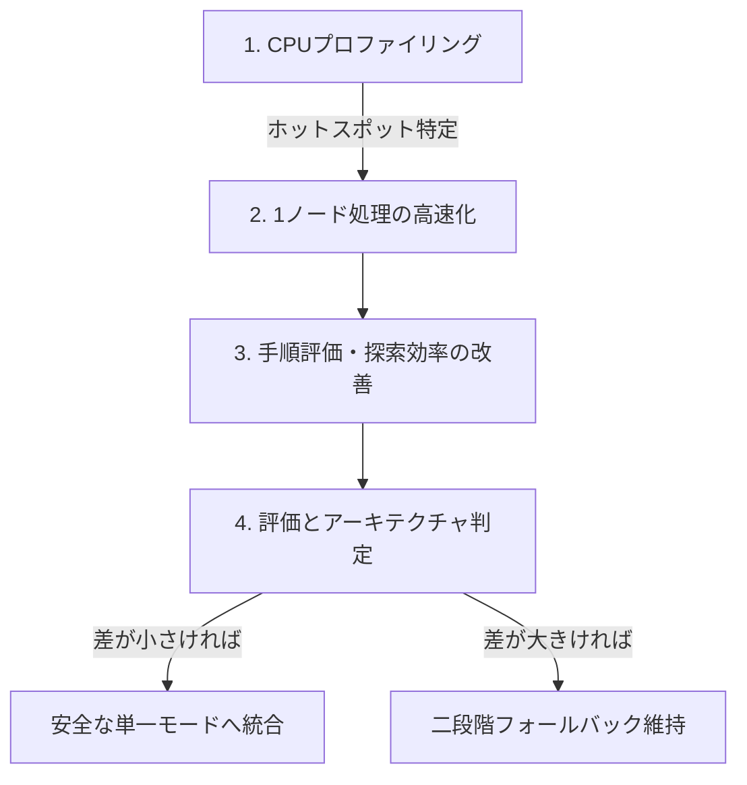

# ソルバーの知見と今後の高速化改善計画

## 1. 概要と背景

Microsoft FreeCell互換のGame #1〜#32000を対象としたソルバー（IDA* + 自動ホーム + 置換表）の
開発において、フェーズ3（安全性・完全性検討）およびフェーズ4（全32,000ゲーム性能評価）を
通じて得られた知見と、今後の高速化・最適化計画をまとめる。

---

## 2. これまでに得られた主要な知見

### 2.1 自明だが弱すぎる許容下限と探索空間爆発

- **問題の発生**:
  - フェーズ3において、「安全モードでは過大評価しない証明可能な下限を使うべき」として
    `useAdmissibleBound: true` を導入した。盤面カード数も考慮した評価は
    $h_{\mathrm{home}}(s) = \text{totalCards} - \text{totalHome}$ である。
  - その結果、全32,000ゲームの計測で、高速モード（200万ノード）で未解決だった26ゲームが
    安全モード（1,000万ノード）でも**26件すべて `node-limit` で1件も解けない**現象が発生した。
- **原因の究明**:
  - フリーセルをクリアするには通常70〜100手以上の複雑な移動が必要である。
  - カードがホームに入らない限り $h_{\mathrm{home}}$ は減少しない。さらにホーム移動では
    $g$ が1増え、$h_{\mathrm{home}}$ が1減るため、$f = g + h$ は改善しない。このため IDA* の
    閾値がほぼ1ずつしか進まず、深さ70〜100に達するまで幅広い深さ制限 DFS を多数反復していた。
  - 分岐係数 $b \approx 4 \sim 10$ のため、Game #1 などの基本ゲームすら1,000万ノードで解けない
    探索空間の指数関数的爆発を引き起こしていた。
- **結論**:
  - 列の未整列度（`tailStart`）を加味して目標への距離を実用的に見積もる探索評価ヒューリスティックが
    不可欠であり、`useAdmissibleBound` は削除した。これは許容的下限ではなく、最短解の保証より
    最初の解の早期発見を優先する非許容評価である。

### 2.2 逆手除外（`isReverse`）の安全性とバグ修正

- **問題点**:
  - 直前の手を取り消す手を刈る「逆手除外」において、自動ホーム移動を消化した後も
    `prevBranch` が保持され続けていた。
  - そのため、「手A $\to$ 自動ホーム発動 $\to$ 手Aの逆手」のように**盤面からカードが減って
    状態が変化している（元に戻るわけではない）にもかかわらず、誤って逆手と判定して除外**し、
    解に必要な手順を失うリスクがあった。
- **修正内容**:
  1. `makeMove()` 内で自動ホーム移動が1手以上発生した場合、`prevBranch = null` にリセットする。
  2. スーパームーブでの一部枚数の戻し手を誤除外しないよう、移動枚数 `count` も一致する場合のみ
     逆手と判定する。
- **結果**:
  - これにより、自動ホームを挟まない純粋な往復手（完全な同一状態への復帰）のみが除外され、
    安全モードでも安全に逆手除外を有効化できるようになった。

### 2.3 正常化安全モードの実力と難関ゲームの解決

探索評価を調整し、安全な自動ホーム条件（Horne's Rule相当）＋危険手の分岐探索を備えた
安全ホーム探索モード（1,000万ノード）で再検証を行った。このモードは安全条件外のホーム移動を
探索分岐として保持するが、非許容評価を用いるため最短解・完全性を保証するモードではない。

- **高速モード未解決26ゲームの検証結果**:
  - 26ゲーム中 **24ゲームが解決（solved）**。
  - 未解決として残ったのは **Game #11982**（解けないゲームとして有名）と **Game #26334** の2件のみ。
  - 全32,000ゲームにおける二段階ソルバーの実質解決率は **99.99375%（31,998 / 32,000）** に達する。
- **探索ノード数の削減効果**:
  - 解決した24ゲームにおいて、安全モードは高速モード（1,000万ノード設定）と比較して
    探索ノード数を **28.31% 削減**（68,130,990 vs 95,035,961ノード）した。
    - この難関セットでは、安全でないホーム移動を即時適用せず分岐に残す構成が有効だった。
      ただし寄与度を断定するには、探索評価・置換表設定を固定して `safeFoundationMoves` のみを
      切り替える A/B テストが必要である。

### 2.4 代表800ゲームによるモード間特性比較

全32,000ゲームから均等抽出した800ゲームでの比較結果:

| 指標 | 高速モード (fast) | 正常化安全モード (safe) | 備考 |
| --- | ---: | ---: | --- |
| 解決数 | 799 / 800 | **800 / 800** | safeのみ #4959 を解決 |
| `node-limit` | 1 | **0** | |
| 総探索ノード数 | 15,533,961 | 31,550,921 | safeは約2.03倍 |
| 平均ノード数 | 19,417 | 39,439 | |
| p50 ノード数 | 3,427 | 9,519 | |
| p90 ノード数 | 48,684 | 94,536 | |
| p99 ノード数 | 188,263 | 443,535 | |
| 総計算時間 | 24,040 ms | 38,137 ms | safeは約1.59倍 |
| 平均時間 | 30.05 ms | 47.67 ms | |
| **p50 時間（中央値）** | **14 ms** | **18 ms** | **差はわずか 4 ms** |
| p90 時間 | 55 ms | 104 ms | |
| p99 時間 | 209 ms | 455 ms | |

- 通常のゲームでは、無条件自動ホームを行う高速モードがノード数を約半分に抑えて最速で動作する。
- ただし実時間の中央値は 14ms vs 18ms と差が小さく、安全モードも十分に実用的な速度を持つ。

---

## 3. 今後の高速化・改善計画

高速化のアプローチを「**1ノードあたりの処理速度向上（吞吐量）**」と「**探索ノード数削減（探索効率）**」の
2つの軸に分離して進める。

### 3.1 フェーズA: CPUプロファイリングとボトルネック特定

- **目的**: 推測に頼らず、CPU時間を消費している関数・処理を定量的に特定する。
- **作業内容**:
  - V8 CPU Profiler または Node.js `--prof` を使用して、通常ゲームおよび難関ゲーム探索時の
    プロファイルを採取する。
  - 主な調査対象:
    1. `getStateHash()`: 8列のソート処理および Zobrist キー結合のコスト。
    2. `generateMoves()`: 毎ノードでの合法手配列およびオブジェクトのアロケーション（GC圧迫）。
    3. `moveScore()`: 手の順序付け計算コスト。
    4. `tt.lookup()` / `tt.store()`: 置換表のハッシュ検索・プローブコスト。

### 3.1.1 フェーズA実施結果（2026-08-18）

- **計測方法**:
  - Node.js v24.19.0 の `--cpu-prof`（V8 サンプリングプロファイラ）で採取し、
    `scripts/benchmark/analyze-profile.js` で関数単位の自己時間・総時間を集計した。
  - 呼び出し回数は `solve({ trackCounters: true })` が返す `stats.profile` を利用する
    （`scripts/benchmark/profile.js --counters` で表示）。
  - アナライザは無名関数を「ファイル:行」単位で分離して集計する（名前だけだと
    `Array.sort` の比較コールバックなど別場所の無名関数が1つに混ざるため）。
  - 対象:
    - 通常ゲーム: Game #720（fast、1,538,122 nodes / 1,297 ms）
    - 難関ゲーム: Game #14212（safe、8,832,537 nodes / 9,235 ms）
      ※高速モード未解決26ゲームのうち、安全モードで最もノードを要して解決した1つ
      （`verify-safe-normalized-all-10000000.json` より）。#11982 / #26334 は
      10M ノードでも未解決のため、探索が上限打ち切りになる点で性質が異なる。
  - 生データ: `docs/benchmark/data/profile-normal-fast-720.cpuprofile` /
    `docs/benchmark/data/profile-hard-safe-14212.cpuprofile`

#### 通常ゲーム（Game #720, fast, 1,538,122 nodes, 1,297 ms）

| 関数 | self 時間 | self% | 呼び出し回数 | 備考 |
| --- | ---: | ---: | ---: | --- |
| `getStateHash` | 326.1 ms | 23.74% | 383,785 | 展開ノード毎 |
| `generateMoves` | 304.2 ms | 22.14% | 166,173 | 展開ノード毎 |
| `search` | 208.5 ms | 15.18% | 1,538,122 | 本体ループ・TT・order |
| `makeMove` | 84.9 ms | 6.18% | 1,538,121 | 自動ホーム閉包含む |
| `doUnapply` | 75.1 ms | 5.47% | — | |
| `doApply` | 66.0 ms | 4.80% | — | |
| GC | 58.4 ms | 4.25% | — | アロケーション圧迫 |
| `getStateHash` の sort 比較器 | 39.5 ms | 2.88% | — | `order.sort(...)` の無名関数 |
| `tt.lookup` | 37.6 ms | 2.74% | 383,785 | maxProbe=5 |
| `tt.stats()` | 37.3 ms | 2.71% | 1 回 | 配列全走査 |
| `tt.store` | 27.8 ms | 2.02% | 166,173 | |
| `maxMovableTo` | 21.1 ms | 1.54% | — | |
| `moveScore` | 12.3 ms | 0.89% | 1,538,913 | 呼び出し最多だが安価 |

`getStateHash` クラスタ（self + sort 比較器 + `Array.from` コールバック）合計 ≈ **26.9%**、
`generateMoves` クラスタ（self + `moves.sort` 比較器）合計 ≈ **22.7%**。

#### 難関ゲーム（Game #14212, safe, 8,832,537 nodes, 9,235 ms）

| 関数 | self 時間 | self% | 呼び出し回数 | 備考 |
| --- | ---: | ---: | ---: | --- |
| `getStateHash` | 3,383.5 ms | 36.30% | 4,056,996 | 展開ノード毎 |
| `generateMoves` | 1,753.6 ms | 18.81% | 1,559,577 | 展開ノード毎 |
| `search` | 1,642.7 ms | 17.62% | 8,832,537 | 本体ループ・TT・order |
| `makeMove` | 722.6 ms | 7.75% | 8,832,536 | 自動ホーム閉包含む |
| `getStateHash` の sort 比較器 | 426.1 ms | 4.57% | — | `order.sort(...)` の無名関数 |
| `doApply` | 369.1 ms | 3.96% | — | |
| `doUnapply` | 342.2 ms | 3.67% | — | |
| GC | 180.8 ms | 1.94% | — | アロケーション圧迫 |
| `maxMovableTo` | 100.8 ms | 1.08% | — | |
| `moveScore` | 80.3 ms | 0.86% | 8,833,443 | 呼び出し最多だが安価 |
| `tt.store` | 60.1 ms | 0.64% | 1,559,577 | maxProbe=16 |
| `isSafeFoundationMove` | 45.7 ms | 0.49% | — | 難関特有の危険手判定 |
| `tt.stats()` | 45.6 ms | 0.49% | 1 回 | 配列全走査 |
| `tt.lookup` | 4.7 ms | 0.05% | 4,056,996 | プローブ6,490,700回 |

`getStateHash` クラスタ合計 ≈ **41.4%**（3,824 ms）、`generateMoves` クラスタ合計 ≈ **19.0%**。
TT 負荷率 26.60%（used=1,115,547 / 4,194,304）、`tt.stats()` は 45.6 ms の固定コスト。

#### 主な知見とフェーズB への示唆

1. **`getStateHash()` が最大のボトルネック（クラスタ合計 通常 27% / 難関 41%）**:
   - self に加え、内部の `order.sort()` 比較器（難関で 4.57% = 426 ms）と `Array.from`
     コールバックを合算すると、難関ゲームでは総時間の **約4割** を占める。
   - 呼び出し比率は難関で 0.46 回/ノード（通常 0.25）と高く、1回あたり約 0.94 µs。
   - フェーズB の最優先。8列固定の挿入ソート / 比較ネットワーク、ソート結果の
     再利用、差分ハッシュ更新が最も効く。
2. **`generateMoves()` が 2 番目のボトルネック（クラスタ合計 通常 23% / 難関 19%）**:
   - 1回あたり約 1.1 µs。手の生成ループ・`canPlace()` / `maxMovableTo()` ・
     オブジェクト生成が主因。手生成のアロケーション削減とループの整理が有効。
3. **`search()` 自身の self が 15〜18%**:
   - orderingHeuristic の呼び出し、TT 参照、手ループ、`min` 更新などの本体処理。
   - JIT インライン化により `tt.lookup()` / `tt.store()` の一部が `search` 側へ
     帰属し得るため、両者の内訳は実行間で変動する（#14212 では lookup が 0.05% と
     極端に小さく、プローブループ自体は軽い）。
4. **`makeMove()` + `doApply()` + `doUnapply()` が約 15%（難関）**:
   - `makeMove()` の自動ホーム閉包ループ（`findHomeMove()` がノード毎に約 1.0 回）が主因。
   - 自動ホーム対象カードの検索を差分更新へ変える余地がある。
5. **GC が通常 4.3% / 難関 1.9%**:
   - move オブジェクト（nodes と同数の生成）、`getStateHash()` の `Array.from` +
     ソート、`splice()` による配列確保が要因。手のパック・固定プール化で削減できる。
6. **`moveScore()` は呼び出し回数が最多（nodes と同数）だが self は約 1%**:
   - 計算自体は安価。文書の調査対象 3 は実測では優先度が低く、フェーズC の
     探索ノード削減（手順評価の内容改善）として別軸で扱う。
7. **`tt.lookup()` / `tt.store()` は合計で約 0.7%（難関）と軽量**:
   - プローブループ自体は極めて軽い。容量拡大より置換方針の改善（浅い g の保持）の
     方が効果がある見込み。`tt.stats()` は 45.6 ms の固定コストで、探索が長いほど
     相対比率は下がる（#720 では 2.71%、#14212 では 0.49%）。

### 3.2 フェーズB: 1ノードあたりの処理速度向上（吞吐量: nodes/sec 向上）

アルゴリズム（探索木）を変えずに、毎ノードの実行オーバーヘッドを削減する。

1. **オブジェクトアロケーションの削減**:
   - 毎ノードで `{ cardId, fromZone, fromIndex, destZone, destIndex, count }` を生成している。
   - 手の情報を 32bit 整数にパック（または固定プール化）し、GC（ガベージコレクション）の
     発生頻度を抑える。
2. **状態ハッシュ計算の最適化**:
   - 現在は 8 列のハッシュを計算した後に配列ソートしている。
   - 列数が 8 列固定であることを利用した軽量なソート（挿入ソートや固定比較ネットワーク）への
     変更、または差分ハッシュ更新の可能性を検討する。
3. **置換表の統計管理の軽量化**:
   - `tt.stats()` で容量 $2^{22}$ の配列を全走査している処理を、`store()` 時のカウンタ管理に変更する。

### 3.2.1 フェーズB実施結果（2026-08-19）

フェーズA のプロファイル結果に基づき、次の3点を実装した（`src/js/solver.js`）。

1. **手の 32bit 整数パック化**:
   - `{ cardId, fromZone, fromIndex, destZone, destIndex, count }` の move オブジェクトを廃止し、
     21bit にパックした整数で探索内を扱う。bit 割り当ては cardId 6bit /
     fromZone 2bit / fromIndex 3bit / destZone 2bit / destIndex 3bit / count 5bit。
   - スコアは並列配列で管理し、`Array.prototype.sort` の比較器コールバックをやめて
     moves / scores を連動させた安定挿入ソートへ変更。ソートは手数が高々数十なので十分軽い。
   - 探索終了時に外部向けオブジェクト形式へアンパックして返すため、API・UI・テストは不変。
2. **`getStateHash()` の軽量化**:
   - `Array.from` + `Array.prototype.sort`（比較器コールバック付き）をやめ、再利用バッファ
     `colOrder` を毎回 `[0..7]` に初期化してからインラインの安定挿入ソートへ変更。
   - 8列固定なので比較回数は高々28回。未使用だった `order` の返却も廃止。
   - 順序は元の安定ソート（列ハッシュの昇順、同値は元の添字順）と完全一致するため、
     状態ハッシュ・探索結果は不変。
3. **置換表の統計管理をカウンタ化**:
   - `tt.stats()` の配列全走査をやめ、`store()` / `clear()` で使用スロット数を増減する
     カウンタ管理へ変更（フェーズAで 1 回の走査が 37〜46ms と判明したため）。
4. **`maxMovableTo()` の事前計算**:
   - `canPlace()` が候補ごとに移動可能枚数上限を再計算（空きフリーセル数・空列数を毎回走査）
     していたのを、`generateMoves()` の冒頭で移動先ごとに1回だけ計算する `maxMoveByDest`
     配列へ変更。手生成中は盤面が不変のため正しい。

#### 計測結果（before → after）

探索ノード数は**完全に同一**（探索木は不変）で、実行時間のみが短縮された。

| ゲーム | モード | ノード数 | before | after（最終） | 高速化 |
| --- | --- | ---: | ---: | ---: | ---: |
| #720 | fast | 1,538,122 | 1,297 ms | **約 794 ms** | **約1.6倍** |
| #14212 | safe | 8,832,537 | 9,235 ms | **約 4,890 ms** | **約1.9倍** |

- 関数別自己時間の変化（#14212 safe、`--cpu-prof`）:

| 関数 | before | after | 備考 |
| --- | ---: | ---: | --- |
| `getStateHash`（クラスタ） | 約41%（3,824 ms） | **9.75%（518 ms）** | sort比較器等を廃止 |
| `generateMoves` | 18.81%（1,754 ms） | 29.10%（1,545 ms） | 絶対値は減少、相対で最上位に |
| `search` | 17.62%（1,643 ms） | 28.31%（1,503 ms） | 絶対値は同程度 |
| `makeMove` | 7.75%（723 ms） | 10.88%（578 ms） | 絶対値は減少 |
| GC | 1.94%（181 ms） | 2.22%（118 ms） | 絶対値は約35%減少 |
| `tt.stats()` | 0.49%（46 ms） | 消失 | 配列走査の廃止 |

- ボトルネックの主役は `getStateHash` から `generateMoves` へ移った。次の最適化候補は
  `generateMoves`（`isReverse` / ループ本体）、`search` 本体、`makeMove` の
  自動ホーム閉包ループ、`doApply` / `doUnapply` の `splice()` である。
  ただし効果は限界効用が小さく、フェーズC（探索ノード数削減）の方が優先度が高い。
- 生データ: `docs/benchmark/data/profile-*-after-b.cpuprofile`

### 3.3 フェーズC: 探索木の削減と探索効率の改善（探索ノード数削減）

探索木の不要な枝を安全に削減し、残った枝を解へ速く誘導する。処理速度の微最適化より先に、
状態の対称性と IDA* 向けの置換表を改善して探索ノード数を減らす。

1. **対称性削減の取り切り**:
   - 空きフリーセルへの移動先を先頭の1スロットへ正規化する。フリーセルのスロット番号を
     状態ハッシュが区別しないため、同じカードを複数の空きスロットへ置く遷移は同値である。
   - 列全体を空列へ移す手を除外する。列順を正規化する現在の状態表現では、これは列ラベルを
     入れ替えるだけの自己対称遷移である。
2. **IDA* 向け置換表の改善**:
   - 現在の最小 $g$ による支配判定に加え、探索済み状態から返った最小超過値（残余 cutoff）を
     保存し、再訪時に次の閾値情報を親へ返す方式を検証する。
   - プローブ上限到達時は、浅い $g$ のエントリを優先して保持する置換方針を比較する。
     容量拡大は、負荷率・プローブ長・置換数・TT ヒット数を計測してから判断する。
3. **手順評価（`moveScore`）の洗練**:
   - 空列作成、深い位置に埋もれたカードの解放、フリーセルの解放・消費、既存の整列列を壊す
     コストを特徴量として評価する。空列に置けるのはキングに限らないため、キング固定の優先は
     採用しない。
   - 候補手の仮適用後に連鎖する安全ホーム移動数を $\Delta H$ として測り、子順序へ反映する。
     仮適用コストを抑えるため、既存スコアの上位候補だけを再評価する二段階方式も比較する。
   - `tailStart` は bound に使う探索評価と子順序用の特徴量に分離し、寄与を個別に測定する。
4. **危険なホーム移動の順序付け改善**:
   - 安全モードにおいて、安全でないホーム移動を探索する優先順位を最適化する。
5. **デッドロック（詰み）の早期検出は後順位**:
   - 「フリーセルや空列がなく tableau 内で循環する」ことは厳密な詰み条件ではない。
     `moves.length === 0` 以外の規則は、反例セットによる安全性検証を伴う独立タスクとして扱う。

### 3.3.1 フェーズC実施結果（2026-08-19）

優先度の高い「対称性削減の取り切り」と「置換表の置換方針」を実装した（`src/js/solver.js`）。

1. **空きフリーセルへの移動先を先頭スロットへ正規化**:
   - 列 → フリーセルの手を「先頭の空きスロット」だけに限定。フリーセルはスロット番号を
     状態ハッシュが区別しないため、複数の空きスロットへ置く遷移はすべて同一状態（同値）だった。
   - 探索終了時も先頭詰めのスロット番号を使うため、返す手は実ゲームで再生可能。
2. **列全体を空列へ移す自己対称手を除外**:
   - `count === 列長` かつ移動先が空列の場合、列ラベルの入れ替えに過ぎず正規化後の状態が
     移動前と同一になるため除外（従来は TT ヒットで打ち切られる無駄な分岐だった）。
3. **置換表の置換方針を改善**:
   - プローブ上限到達時、先頭スロットを無条件上書きするのをやめ、プローブ窓内で最も
     $g$ が大きい（枝刈り価値が低い）エントリを置き換える。候補の $g$ が最大 $g$ 以上なら
     挿入しない（浅いエントリを保護）。置換方針は安全性に影響しない。
   - ※現在の負荷率（最大26.6%）では `overwrites=0` のため実測効果はないが、
     容量削減・高負荷時の防御として組み込んだ。

#### 計測結果（before → after、ノード数削減）

| ゲーム | モード | before ノード | after ノード | 削減 |
| --- | --- | ---: | ---: | ---: |
| #720 | fast | 1,538,122 | 1,449,895 | **-5.7%** |
| #14212 | safe | 8,832,537 | 8,501,203 | **-3.8%** |
| #6240 | safe | 8,248,745 | 7,926,718 | **-3.9%** |
| #3670 | safe | 5,565,002 | 5,137,955 | **-7.7%** |
| #4016 | safe | 4,490,847 | 4,279,922 | **-4.7%** |

- 検証:
  - ゲーム1〜200 は fast-safe で **200/200 解決**（退行なし）。
  - 難関セット（#6240 / #3670 / #4016）は safe で解決し続ける。
    #11982 は node-limit のまま（既知の未解決ゲーム、退行なし）。
  - 単体 140 件・E2E 63 件すべて成功。
- 削減効果は対称手が TT で打ち切られていた分（適用・取り消し・ハッシュ・再帰）だけなので
  数%程度に留まるが、探索木そのものの分岐数を減らす点で確実な改善である。

#### フェーズC の残タスク

- **残余 cutoff の保存（検証の結果、見送り）**:
  - 検討の結果、**このソルバーでは効果が得られない（冗長）と判断**した。理由は以下。
    1. 置換表は「最小 $g$」を保持するため、状態 $S$ はより浅い経路で来た場合にだけ再展開される。
    2. $S$ が最初（最浅）の訪問で部分木を完全探索したときの cutoff $t$ は、`min` の集約を通じて
       **既にルートまで伝播している**。
    3. より深い経路（$g > g_s$）での再訪時に復元できる値は $g + (t - g_s) > t$ となり、
       **必ず既知の $t$ より大きい**ため、次の `bound`（最小 cutoff）を改善できない。
    4. 反復ごとに `tt.clear()` するため、反復をまたいだ cutoff 再利用の恩恵もない。
  - この結論は $h$ の許容性と無関係に成立する（同一状態なら $h$ は一致するため、f 値の
    「ずれ」の議論だけが効く）。
- **手順評価（`moveScore`）の洗練 / ヒューリスティック $h$ の精度向上（実施済み）**:
  - 結果は §3.3.2 を参照。採用したのは「低ランク露出の加点」と「`tailStart` の重み1.1倍」。

### 3.3.2 moveScore とヒューリスティックの A/B 結果（2026-08-19）

固定サンプル（通常200ゲーム fast-safe / 難関5ゲーム safe）で A/B 比較し、
ノード数と解決率で採用可否を判断した（`scripts/benchmark/sample-bench.js`）。

#### moveScore の候補

| 候補 | 内容 | 難関5 (safe) | 通常200 (fast-safe) | 判定 |
| --- | --- | ---: | ---: | ---: |
| ベースライン | 変更なし | 27,977,784 | 2,839,257 | — |
| **A（採用）** | 露出rank≤3:+6000 | 19,610,333 | 2,293,855 | 採用 |
| B（破棄） | ホーム距離加点 | 15,717,729※NL | 6,654,331 | 破棄 |
| C（破棄） | フリーセル容量の保全（解放加点・最後の空きにペナルティ） | 20,864,427 | 5,679,222 | 破棄（通常が悪化） |

- **A の知見**: 「低ランク（A・2・3）の露出に固定的に加点」は、将来のホーム送り素材を
  早期に露出するため有効。一方、ホーム送りまでの**距離を細かく刻む加点（B）**は
  探索を過度に誘導して解決率を損なうため逆効果だった。

#### ヒューリスティック $h$ の候補（A を採用した状態での比較）

| 候補 | tailStart の重み | 難関5 (safe) | 通常200 (fast-safe) | 判定 |
| --- | ---: | ---: | ---: | ---: |
| 1x | 1.0 | 19,610,333 | 2,293,855 | — |
| **1.1x（採用）** | 1.1 | **416,585** | **1,836,387** | **採用（難関-98% / 通常+20%）** |
| 1.25x | 1.25 | 114,769 | 3,388,863 | 破棄（通常が1.5倍に悪化） |
| 1.5x | 1.5 | 137,334 | 5,338,377 | 破棄（通常が2.3倍に悪化） |
| 2x | 2.0 | 168,368 | 37,764,194 + 1 node-limit | 破棄（通常が爆発） |

- **1.1x の知見**: `tailStart` の重みをわずかに上げる（1.1倍）だけで、難関ゲームは
  「1回の反復で解を見つける」挙動になり劇的に縮小（19.6M → 417K）、通常ゲームも
  効率が改善（2.29M → 1.84M）した。重みを上げすぎると通常ゲームで探索が過剰になり
  逆効果（1.25x 以上で悪化、2x では node-limit 発生）。

#### 採用後の全体効果（A + 1.1x）

- **通常ゲーム1〜400**: すべて解決。200ゲームあたりの合計ノードは約 1.84M
  （ベースラインの約 2.84M から **約35%削減**）。
- **高速モード未解決26ゲーム**: **25/26 解決**（#11982 のみ node-limit、既知の未解決）。
  内訳は **20ゲームが fast モードだけで解決**（従来は 0 ゲーム）、5ゲームは safe で短時間解決。
  **#26334 は従来未解決だったが、fast モードで解決可能になった**（70万ノード）。
- これにより fast-safe の二段階フォールバックはほぼ不要になり、フェーズD（単一モード統合）
  の前提が大きく前進した。
- 単体 140 件・E2E 63 件すべて成功。markdownlint 診断クリア。

### 3.4 フェーズD: アーキテクチャ判定（単一モード統合 vs 二段階維持）

- **評価基準**:
  - 安全モードの実行速度が十分に向上し、高速モードとの実時間差がごくわずかとなった場合、
    **「二段階フォールバック」を廃止し、「常に安全な単一モード」へ統合**することを検討する。
  - 統合のメリット:
    - 二段階の管理コード・設定が不要になり、アーキテクチャが大幅にシンプル化する。
    - 高速モード失敗時の200万ノード分の空振りがゼロになり、難関ゲームの応答時間が短縮される。
- **検証セット**:
  1. **通常セット（800ゲーム）**: 平均時間・中央値・退行がないかの確認。
  2. **難関セット（26ゲーム）**: 未解決ゲームの解決可否・最大ノード数の確認。
  3. **差分実験**: bound 用評価、子順序、`safeFoundationMoves`、TT 置換方針を一度に1要素だけ
     切り替え、ノード数・時間・解決可否への寄与を分離する。
